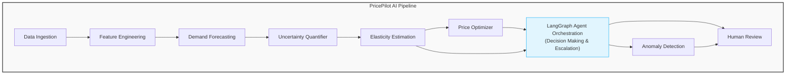

# PricePilot AI: AI-Native Dynamic Pricing Engine

> **Human-on-the-Loop Dynamic Pricing for Physical Businesses**
>
> A portfolio/reference implementation demonstrating modern AI techniques for revenue management.

[](https://www.python.org/downloads/release/python-3110/)
[](https://github.com/psf/black)
[](https://pycqa.github.io/isort/)
[](https://mypy-lang.org/)
[](https://opensource.org/licenses/MIT)

## Overview

PricePilot AI is an educational/reference implementation of an AI-native dynamic
pricing system designed for small physical businesses (parking garages, car
washes, self-storage, pet groomers, laundromats). Unlike traditional static
pricing, this system continuously estimates how demand responds to price changes
and optimizes pricing strategies in real-time.

### Key Features

- **Probabilistic Demand Forecasting**: Temporal Fusion Transformer (TFT) and
  ARIMA baselines
- **Causal Inference**: Bayesian estimation of price elasticity using PyMC
- **Constrained Optimization**: Mathematical programming for optimal price
  discovery
- **Human-on-the-Loop**: Agentic workflows with uncertainty quantification and
  anomaly detection
- **MLOps Ready**: MLflow tracking, experiment management, and model versioning

## Architecture




## Quick Start

### Prerequisites

- Python 3.11+
- [UV](https://github.com/astral-sh/uv) Package manager
- Docker (optional)

### Installation

```bash
# Clone the repository
git clone https://github.com/yourusername/pricepilot-ai.git
cd pricepilot-ai

# Create virtual environment
uv venv --python 3.11
.venv\Scripts\activate  # Windows
# source .venv/bin/activate  # Linux/Mac

# Install dependencies
uv sync

# Set up environment variables
cp .env.example .env
```

### Generate Synthetic Data

```bash
# Generate 2 years of synthetic car wash data
uv run python scripts/generate_data.py
```

### Run the Pipeline

```bash
# Run the complete pricing pipeline
uv run python scripts/run_pipeline.py
```

### Start the API

```bash
# Start FastAPI server
uv run uvicorn src.pricepilot.api.main:app --reload
```

## Core Components

### 1. Demand Forecasting

* Temporal Fusion Transformer (TFT): Multi-horizon probabilistic forecasting
* ARIMA/Prophet: Statistical baselines for comparison
* Conformal Prediction: Uncertainty quantification using MAPIE

### 2. Causal Inference & Elasticity

* Bayesian Regression: PyMC-based estimation of price elasticity
* Difference-in-Differences: Isolation of pricing effects from confounders
* Quantile Regression: Demand distribution tail estimation

### 3. Optimization Engine

* Constrained Optimization: SciPy/CVXPY for price optimization
* Reinforcement Learning: Contextual bandits for exploration-exploitation
* Business Rules: Configurable constraints and bounds

### 4. Human-on-the-Loop

* LangGraph Workflows: State machine-based decision orchestration
* Anomaly Detection: PyOD for demand spike detection
* Escalation Logic: Automatic human review routing for low-confidence decisions

## Experiment Tracking

```bash
# Start MLflow UI
mlflow ui --backend-store-uri sqlite:///mlflow.db
```

## Testing

```bash
# Run all tests
pytest

# Run with coverage
pytest --cov=src/pricepilot --cov-report=html

# Run specific test file
pytest tests/test_elasticity.py -v
```

## Notebooks

* [Mathematical Proof](docs/01-math-proof-notebook.md)

## Configuration
Configuration is managed through environment variables and YAML files:

- `.env`: Environment-specific settings
- `configs/model_config.yaml`: Model hyperparameters
- `configs/business_rules.yaml`: Pricing constraints

Educational Resources
- [Price Elasticity of Demand](https://en.wikipedia.org/wiki/Price_elasticity_of_demand)
- [Dynamic Pricing](https://en.wikipedia.org/wiki/Dynamic_pricing)
- [Temporal Fusion Transformers](https://arxiv.org/abs/1912.09363)
- [Conformal Prediction](https://arxiv.org/abs/2107.07511)