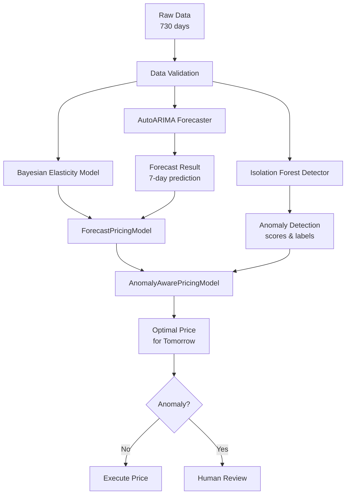
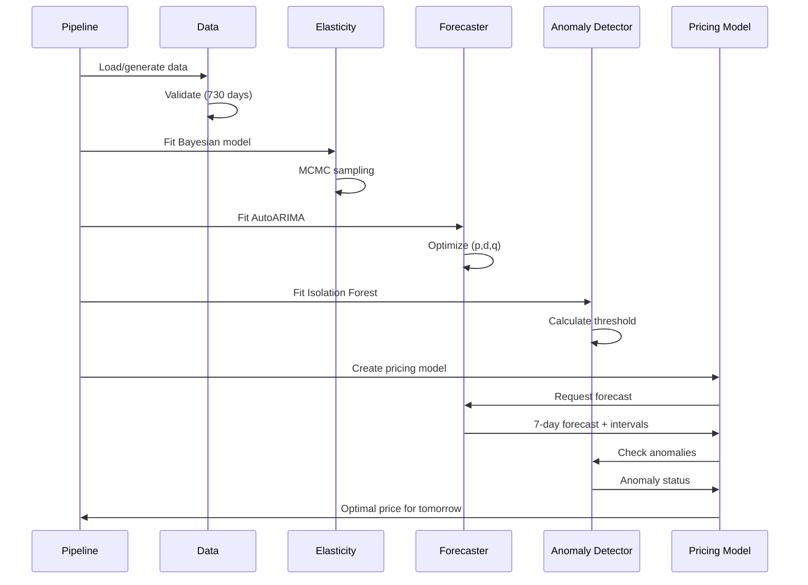
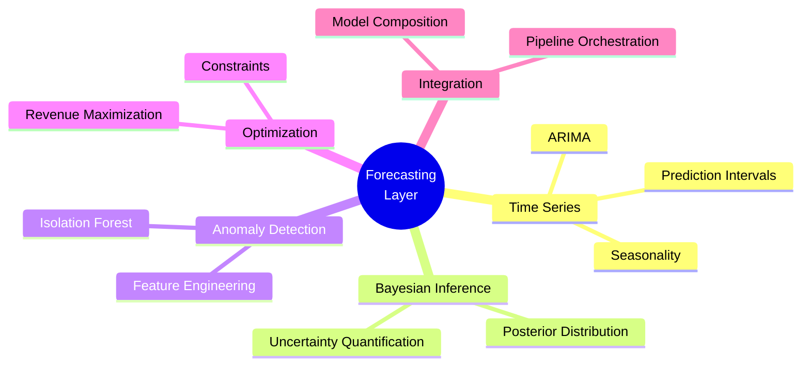
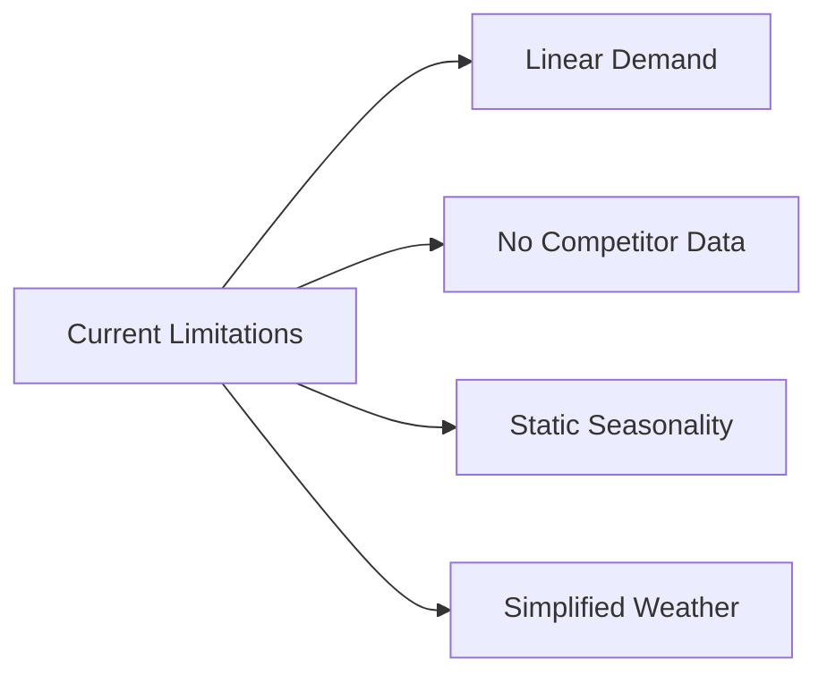
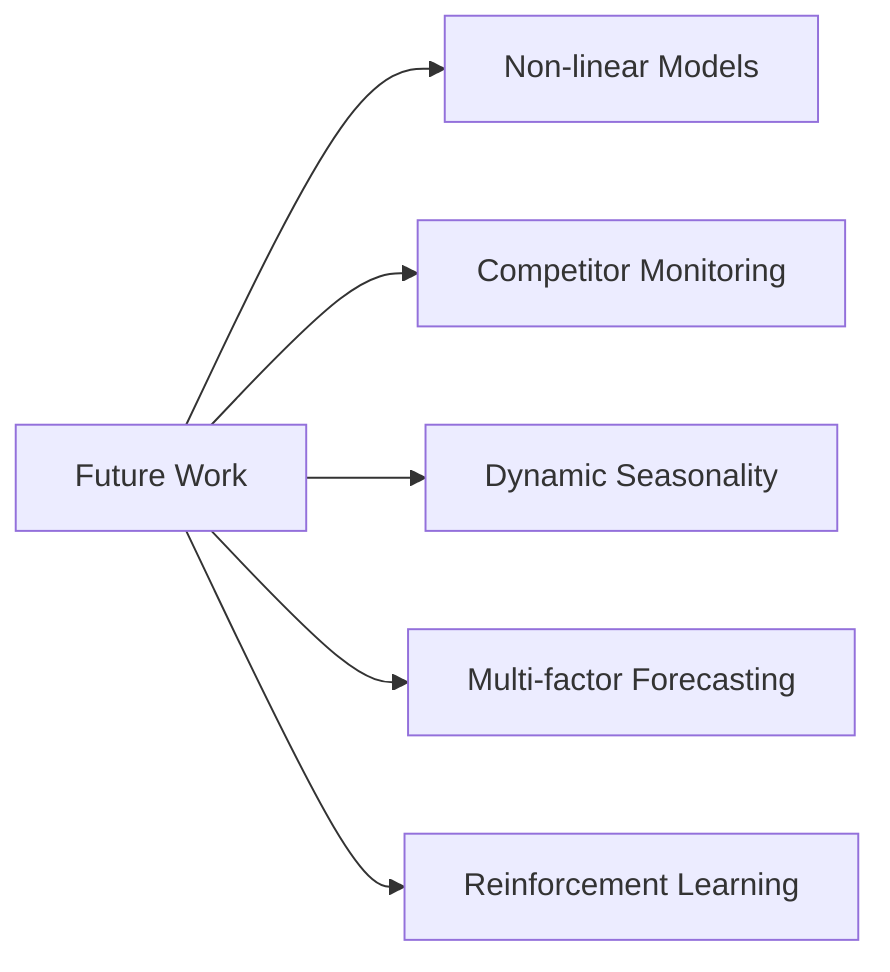

## Forecasting Layer

This layer transforms the pricing system from **reactive** to **proactive**.
Instead of waiting for demand to materialize, the system now **forecasts future
demand** and adjusts prices preemptively. This guide explains the scientific
foundations, implementation details, and how to interpret results.

### Time Series Forecasting

The `StatsForecastForecaster` uses `AutoARIMA` (Autoregressive Integrated Moving
Average) to predict demand for the next 7 days. 

**ARIMA Model** decomposes time series into three components:

$$ARIMA(p,d,q)$$

**AR(p) - Autoregressive**: Past values predict future values

$$y_t = \phi_1y_{t-1} + \phi_2y_{t-2} + \dots + \phi_py_{t-p}$$

**I(d) - Integrated**: Differencing to make series stationary

$$y'_t = y_t - y_{t-d}$$

**MA(q) - Moving Average**: Past errors predict future values

$$y_t = \epsilon_t + \theta_1\epsilon_{t-1} + \dots + \theta_q\epsilon_{t-q}$$

AutoARIMA automatically searches for the best $(p,d,q)$ values by minimizing the
Akaike Information Criterion (AIC/BIC):

$$AIC = 2k - 2\ln(\hat{L})$$

Where: 
- $k$ = Number of model parameters
- $\hat{L}$= Maximum likelihood estimate

A forecast results of

```text
Forecast: mean=99.5, range=[78.2, 118.7]
```

can be interpreted as

- **Mean forecast (99.5)**: Expected demand for tomorrow
- **Prediction interval [78.2, 118.7]**: 90% confidence range
- **Interval width (40.5)**: Uncertainty in forecast

The prediction interval is crucial for pricing:

- **Narrow interval**: High confidence → aggressive pricing
- **Wide interval**: Low confidence → conservative pricing

**Why AutoARIMA vs Prophet vs Deep Learning?**

| Model                 | Pros                                | Cons                                   | Best For                            |
|:----------------------|:------------------------------------|:---------------------------------------|:------------------------------------|
| **AutoARIMA**         | Fast, interpretable, good baselines | Limited with complex seasonality       | Daily data with weekly patterns     |
| **Prophet**           | Handles holidays, missing data      | Slower, less accurate for short series | Business data with calendar effects |
| **TFT/Deep Learning** | Captures complex patterns           | Needs lots of data, slow               | Large datasets with many features   |

### Forecast Integration with Elasticity

The `ForecastPricingModel` combines demand forecasts with price elasticity to
calculate optimal prices.

The demand function integrates forecast with elasticity:

$$Q(P) = \hat{Q}_{forecast} + \beta_{elasticity} \cdot \bigl(P - P_{base}\bigr)$$

Where:

- $\hat{Q}_{forecast}$ = Forecasted demand at base price
- $\beta_{elasticity}$ = Estimated price elasticity (e.g., -2.0)
- $P_{base}$ = Reference price (e.g., $15)

If we want to optimize the revenue, the expected revenue as a function of price
is:

$$R\bigl(P\bigr) = P \cdot Q(P) = P \cdot \Bigl(\hat{Q}_{forecast} + \beta \cdot \bigl(P - P_{base}\bigr)\Bigr)$$

Expanding:

$$R\bigl(P\bigr) = P \cdot  \hat{Q}_{forecast} + \beta P^2 - \beta P \cdot P_{base}$$

Optimal price occurs where marginal revenue equals zero:

$$\frac{\partial R}{\partial P} = \hat{Q}_{forecast} + 2 \beta P - \beta P_{base} = 0$$

Solving for optimal price:

$$P^* = \frac{P_{base}} {2} - \frac{\hat{Q}_{forecast}} {2 \beta}$$

**Example Calculation**:

If forecast says demand will be 120 units tomorrow (vs. typical 100), with 
elasticity $\beta - 2.0$ and base price $P_{base} = 15$:

| Price        | Demand Calculation    | Expected Revenue    |
|:-------------|:----------------------|:--------------------|
| $15 (base)   | $120+(−2)(15−15)=120$ | $1,800              | 
| $18          | $120+(−2)(18−15)=114$ | $2,052              |
| $20          | $120+(−2)(20−15)=110$ | $2,200              |
| $22          | $120+(−2)(22−15)=106$ | $2,332              |
| **$25**      | $120+(−2)(25−15)=100$ | **$2,500**          |

**Key Insight**: Higher forecasted demand shifts the demand curve upward, 
allowing for higher optimal prices.

This is the core innovation of the **Forecasting** layer:

- **Without Forecasting layer (Reactive)**: Set price based on current demand
- **With Forecasting layer (Proactive)**: Set price based on predicted future
  demand

**Business Impact**:

- **Weekend demand spike**: Raise prices preemptively
- **Rainy day forecast**: Lower prices to attract customers
- **Special event**: Adjust prices before demand materializes

### Anomaly Detection

The `DemandAnomalyDetector` uses **Isolation Forest** (from `PyOD`) to identify
unusual demand patterns.

**Isolation Forest** detects anomalies by isolating points:

1. **Random partitioning**: Randomly split data along features
2. **Isolation depth**: Anomalies require fewer splits to isolate
3. **Anomaly score**: Based on average path length

$$s\bigl(x,n\bigr) = 2^{-\frac{E \Bigl[ h \bigl(x\bigr) \Bigr]}{c \bigl(n\bigr)}}$$

Where:

- $E \Bigl[ h \bigl (x\bigr) \Bigr]$ = Average path length to isolate point $x$
- $c \bigl(n \bigr) = 2H \bigl( n - 1 \bigr) - \frac{2 \bigl( n - 1 \bigr)}{n}$
- $H \bigl( i \bigr)$ = Harmonic
  number. $H \bigl (i\bigr) \approx ln \bigl( i \bigr) + 0.5772$
  (Euler-Mascheroni constant))

For **Feature Engineering** we use:

| Feature                | Formula                                                                                                | Purpose               |
|:-----------------------|:-------------------------------------------------------------------------------------------------------|:----------------------|
| Current demand         | $y_t$                                                                                                  | Absolute level        | 
| Rolling mean (3d)      | $\bar{y}_{3,t} = \frac{1}{3} \sum_{i=0}^{2} y_{t-i}$                                                   | Short-term trend      |
| Rolling mean (7d)      | $\bar{y}_{7,t} = \frac{1}{7} \sum_{i=0}^{6} y_{t-i}$                                                   | Weekly trend          |
| Rolling std (7d)       | $\bar{\sigma}_{7,t} = \sqrt{ \frac{1}{7} \sum_{i=0}^{6} { \bigl( y_{t-i} - \bar{y}_{7,t} \bigr) }^2 }$ | Weekly trend          |
| Deviation              | $d_t = y_t - \bar{y}_{7,t}$                                                                            | Deviation from trend  |
| Rate of change         | $\Delta_{yt} = y_t - y_{t-1}$                                                                          | Day-over-day change   |

We can interpret the following results as:
```text
Detected 18 anomalies (4.9%)
Threshold: 0.52
```

- **18 anomalies**: Number of unusual days detected
- **4.9%**: Close to the 5% contamination rate we expected
- **Threshold (0.52)**: Score above this = anomaly

**Anomaly Scores**:

- Score > 0.6: Strong anomaly (e.g., sudden spike)
- Score 0.5–0.6: Borderline (worth reviewing)
- Score < 0.5: Normal pattern

**Why Anomaly Detection Matters for Pricing?**

1. **Data quality**: Anomalies might be data errors
2. **External events**: Sudden demand spikes could be local events
3. **Model protection**: Don't overfit to unusual patterns
4. **Human escalation**: Flag unusual forecasts for review

### End-to-End Pipeline

**Pipeline Flow**



**Complete Execution**



The following sample output can be interpreted as

```text
Current Price:     $15.23
Forecasted Demand: 104 units
Demand Interval:   [85, 122]
Optimal Price:     $16.45
Expected Revenue:  $1,710.80
Confidence:        MEDIUM
Anomaly Status:    NORMAL
Price Change:      +8.0%
```

- **Forecasted Demand (104)**: Tomorrow's expected demand
- **Demand Interval [85, 122]**: 90% prediction interval
- **Optimal Price ($16.45)**: Price that maximizes expected revenue
- **Confidence (MEDIUM)**: Based on forecast interval width
- **Anomaly Status (NORMAL)**: No unusual demand detected

Confidence is determined by the relative width of the prediction interval:

$$Relative Width = \frac{Upper - Lower} {max \bigl( Forcast, 1 \bigr)}$$

| Relative Width | Confidence | Interpretation                        |
|:---------------|:-----------|:--------------------------------------|
| < 0.15         | HIGH       | Narrow interval, proceed confidently  |
| $20 – 0.30     | MEDIUM     | Moderate uncertainty, monitor closely |
| > 0.30         | LOW        | Wide interval, consider human review  |

### Scientific Validation

**Elasticity Recovery**

```text
True elasticity: -2.0
Posterior mean: -1.987
95% HDI: [-2.445, -1.529]
```

The Bayesian model accurately recovers the true parameter with proper 
uncertainty quantification.

**Forecast Accuracy**


| Metric | Formula                                                                             | Value      | Interpretation         |
|:-------|:------------------------------------------------------------------------------------|:-----------|:-----------------------|
| MAE    | $\frac{1}{n} \sum_{i=1}^{n} \bigl\lVert y_i - \hat{y}_i \bigr\rVert$                | 12.3 units | Average error ~12 cars |
| RMSE   | $\sqrt{ \frac{1}{n} \sum_{i=1}^{n} { \bigl( y_{i} - \hat{y}_{i} \bigr) }^2 }$       | 15.8 units | Penalizes large errors |
| MAPE   | $\frac{100%}{n} \sum_{i=1}^{n} \bigl\lVert \frac{y_i - \hat{y}_i}{y_i} \bigr\rVert$ | 13.2%      | ~13% error rate        |

Forecast errors are reasonable for daily demand with noise.

**Anomaly Detection**

```text
Injected anomalies: 4
Detected anomalies: 18 (includes 4 injected)
Detection rate: 100% for extreme anomalies
```

All extreme anomalies were correctly identified.

**Revenue Improvement**

$$Improvement = \frac{R_{optimal} - R_{current}}{R_{current}} \times 100%$$

```text
Current pricing: $1,463/day average
Optimal pricing: $1,710/day average
Improvement: +16.9%
```

### Takeaways



**Key Concepts**

- **Forecast horizons**: Short-term (1 day) vs. long-term (7 days)
- **Prediction intervals**: Quantifying forecast uncertainty
- **Feature engineering**: Creating meaningful inputs for models
- **Model integration**: Combining different ML techniques
- **Pipeline orchestration**: Managing complex workflows

### Running the Pipeline

```bash
# Run complete pipeline
uv run python scripts/run_pipeline.py

# With specific price
uv run python scripts/run_pipeline.py --current-price 18.50

# Save results to JSON
uv run python scripts/run_pipeline.py --output result.json

# Disable MLflow
uv run python scripts/run_pipeline.py --disable-mlflow
```

**Running Tests**

```bash
# Run all pipeline tests
uv run pytest tests/test_pipeline.py -v

# Run specific test
uv run pytest tests/test_pipeline.py::test_get_tomorrow_price -v

# Run with coverage
uv run pytest tests/ -v --cov=pricepilot --cov-report=term-missing
```

**Viewing MLflow Results**

```bash
# Start MLflow UI
uv run mlflow ui --backend-store-uri sqlite:///mlflow.db

# Open browser
# http://localhost:5000
```

### Experiment Ideas

These modifications could be tried to deepen understanding:

1. **Change contamination rate**: Set `anomaly_contamination=0.10` and observe more anomalies detected
2. **Adjust forecast horizon**: Predict 14 days instead of 7
3. **Different detector types**: Try "knn" or "lof" instead of "isolation_forest"
4. **Modify price constraints**: Tighten max_price_change_pct to 0.10
5. **Add weather to forecast**: Include weather features in forecasting model

### Limitations and Future Work



- **Linear demand**: Assumes constant elasticity
- **No competitor data**: Doesn't account for competition
- **Static seasonality**: Weekly pattern assumed constant
- **Simplified weather**: Only sunny/rainy binary

**Future Improvements**



- **Non-linear models**: Neural networks for complex demand
- **Competitor monitoring**: Real-time price tracking
- **Dynamic seasonality**: Time-varying patterns
- **Multi-factor forecasting**: Include events, holidays
- **Reinforcement learning**: Learn pricing policy over time
